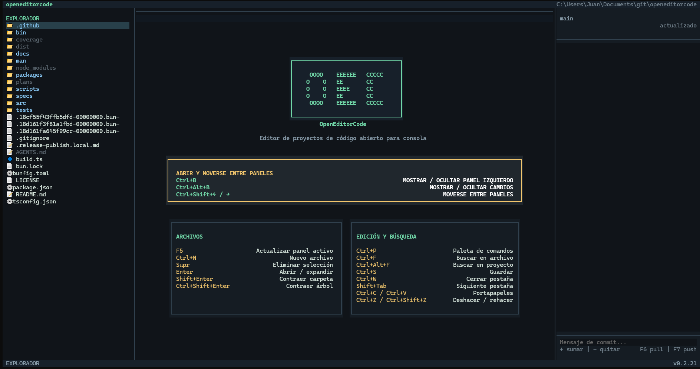

# openeditorcode (OEC)

Editor de proyectos de codigo abierto para consola. Es una aplicación autónoma escrita en TypeScript con Bun y OpenTUI; no necesita OpenCode, servidor ni conexión externa.

## Vista principal

Al iniciar sin documentos abiertos, OEC muestra una portada con los atajos organizados por capacidad. El explorador permanece disponible a la izquierda y el pie indica el estado actual.



## Características

- Explorador virtualizado con iconos por tipo de archivo, selección por teclado y scroll vertical que sigue la selección incluso en proyectos grandes.
- Explorador operable con ratón: clic para seleccionar, expandir carpetas o abrir archivos.
- Creación de archivos en la carpeta seleccionada, sin sobrescribir archivos existentes.
- Varias pestañas abiertas, cambio circular y pestañas clicables con cierre mediante `×`, incluidos diffs Git identificados con `Δ`.
- Editor multilinea con números de línea, resaltado básico para archivos de código, ajuste de línea, deshacer y rehacer.
- Copia mediante OSC 52 y pegado desde el portapapeles de Windows, Wayland o X11.
- Búsqueda local lineal con resultados, navegación por flechas y aplicación con `Enter`.
- Búsqueda global concurrente, persistente y agrupada por archivo, con índice reutilizable de hasta 50.000 entradas.
- Conteo de líneas por archivo y total del proyecto.
- Confirmación modal para cambios sin guardar.
- Eliminación confirmada de archivos y carpetas desde el explorador.
- Panel de cambios Git virtualizado, con procesos asíncronos, actualización automática local y vista diff de solo lectura.
- Navegación y atajos globales aislados del textarea para evitar modificaciones involuntarias al abrir, cerrar o cambiar archivos.
- Protección contra rutas externas, binarios y archivos de más de 2 MB.

## Requisitos

- Windows x64 o Linux x64 con glibc (Ubuntu, Debian, Fedora y derivados).
- Bun 1.3 o posterior para desarrollo.
- Git instalado para el panel de cambios Git.
- En Linux, `wl-paste` (Wayland), `xclip` o `xsel` para pegar desde el portapapeles.

## Instalación

Instala OEC globalmente desde npm:

```bash
npm install -g openeditorcode
```

Después, abre el editor en el directorio actual o indica la carpeta del proyecto:

```bash
oec
oec /ruta/del/proyecto
openeditorcode
openeditorcode /ruta/del/proyecto
```

`oec` y `openeditorcode` son comandos equivalentes.

OEC comprueba actualizaciones en segundo plano después de iniciar. Si hay una versión nueva, la muestra junto a la versión actual y añade **Actualizar OEC** a `Ctrl+P`. La actualización cierra el editor antes de reemplazar el ejecutable y vuelve a abrir el mismo proyecto al finalizar.

La instalación npm incluye únicamente el lanzador y el binario de la plataforma actual; las dependencias de compilación no se instalan globalmente.

## Ejecutar

Desde la carpeta del proyecto `openeditorcode`:

```powershell
bun install
bun run dev
```

Para abrir otro proyecto durante el desarrollo:

```powershell
bun run dev -- C:\ruta\del\proyecto
```

Sin argumento, abre el directorio actual. Tras compilar para Windows, el ejecutable queda en `packages\oec-win32-x64\bin\oec.exe`:

```powershell
.\openeditorcode\packages\oec-win32-x64\bin\oec.exe
```

## Uso básico

1. Pulsa `Ctrl+B` para mostrar u ocultar el explorador.
2. Usa las flechas para mover la selección.
3. Pulsa `Enter` para expandir una carpeta o abrir un archivo.
4. Usa `Tab` para alternar entre explorador, editor y cambios.
5. Guarda con `Ctrl+S`.

Al cerrar una pestaña modificada, el diálogo muestra **Guardar**, **Guardar y cerrar** y **Cerrar sin guardar** (opción predeterminada). Usa flechas arriba/abajo y confirma con `Enter`.

La búsqueda local conserva su consulta al confirmar una coincidencia; pulsa `Esc` para cerrarla y limpiarla. La búsqueda global conserva consulta, resultados y selección al abrir un resultado, reutiliza el índice durante la sesión y se limpia con `Esc` desde el modal.

## Atajos

| Atajo | Acción |
| --- | --- |
| `Ctrl+P` | Paleta de comandos, atajos y configuración |
| `Ctrl+Shift+←` | Mover el foco al panel de la izquierda |
| `Ctrl+Shift+→` | Mover el foco al panel de la derecha |
| `Ctrl+B` | Mostrar u ocultar el explorador de archivos |
| `Ctrl+Alt+B` | Mostrar u ocultar el control de cambios Git |
| `Ctrl+Shift+Enter` | Contraer todas las carpetas del panel activo |
| `F5` | Actualizar el explorador de archivos |
| `Supr` | Eliminar el archivo o carpeta seleccionado |
| `Ctrl+N` | Crear un archivo en la carpeta seleccionada |
| `Shift+Enter` | Alternar la carpeta seleccionada en explorador o cambios |
| `Ctrl+F` | Buscar texto en el archivo abierto |
| `Ctrl+Alt+F` | Buscar texto en todos los archivos del proyecto |
| `Ctrl+S` | Guardar archivo actual |
| `Ctrl+W` | Cerrar pestaña actual |
| `Shift+Tab` | Ir a la pestaña siguiente |
| `Ctrl+C` | Copiar el texto seleccionado |
| `Ctrl+V` | Pegar desde el portapapeles de Windows |
| `Ctrl+Z` | Deshacer el último cambio |
| `Ctrl+Shift+Z` | Rehacer el último cambio |
| `Ctrl+Alt+W` | Alternar ajuste de línea |
| `Ctrl+L` | Ajustar líneas al ancho para ver el contenido completo |
| `Ctrl+Q` | Salir |
| `Tab` | Alternar explorador, editor y control de cambios |
| `Esc` | Cerrar una búsqueda o diálogo |

## Búsqueda y conteo

- `Ctrl+F`: escribe el texto para ver todas las coincidencias locales. Usa flechas para elegir una y `Enter` para llevar el cursor a su inicio.
- `Ctrl+Alt+F`: escribe el texto y pulsa `Enter` para buscar en todo el proyecto. El primer uso construye un índice en memoria; los siguientes lo reutilizan. Tras obtener resultados, usa flechas para elegir uno y `Enter` para abrir el archivo en la línea coincidente.
- `Ctrl+P`: ejecuta **Calcular líneas del proyecto**. El explorador mostrará el conteo a la derecha de cada archivo y el pie mostrará el total final.

## Cambios Git

- `Ctrl+Alt+B` muestra el panel **CAMBIOS**. Sus archivos se organizan en un árbol y usan las mismas flechas, `Enter` y `Shift+Enter` que el explorador.
- OEC muestra el estado remoto de la rama disponible localmente. La paleta incluye **Actualizar referencias remotas de Git** para ejecutar `git fetch --quiet` manualmente.
- Abrir un archivo del panel crea una pestaña `Δ` con el diff anterior/nuevo. Los diffs son de solo lectura, se pueden cerrar normalmente y conviven con el archivo editable.

## Límites de seguridad

- Todas las rutas se validan contra la carpeta raíz seleccionada.
- No se abren ni procesan archivos binarios.
- El límite de lectura y análisis es 2 MB por archivo.
- Los guardados usan un archivo temporal antes de reemplazar el original.
- Los archivos y carpetas definidos en `.gitignore` se muestran en gris y se excluyen del conteo y de la búsqueda global. La carpeta `.git` permanece oculta.

## Desarrollo, pruebas y distribución

```powershell
bun run typecheck
bun run test
bun run build
```

`bun run build` genera el binario de la plataforma actual. También puedes ejecutar `bun run build:windows` o `bun run build:linux`. La publicación de npm compila los binarios en GitHub Actions y los distribuye automáticamente según el sistema operativo. Consulta `AGENTS.md` para la arquitectura y pautas de mantenimiento.
